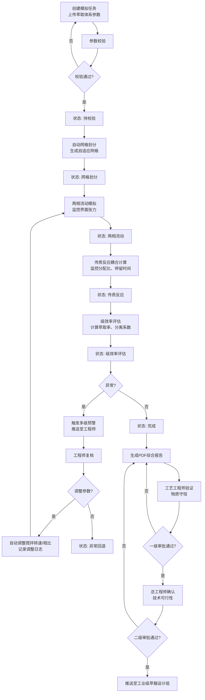
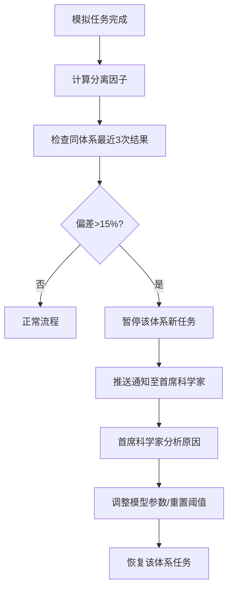

## 1. 产品概述

面向稀土元素溶剂萃取分离的多物理场模拟与工艺参数智能优化平台，为湿法冶金工程师提供从萃取体系参数输入到工业级萃箱设计的全流程数字化解决方案。通过三维两相流-传质-化学反应耦合模拟，结合智能优化引擎，实现萃取工艺的精准预测与高效优化。

- 主要目的：解决稀土萃取分离过程中工艺参数调试周期长、成本高的问题，通过数字化模拟实现"零试错"工艺优化
- 目标用户：湿法冶金工程师、工艺工程师、总工程师、首席科学家、萃箱设计组
- 产品价值：缩短研发周期60%以上，降低实验成本70%，提升分离系数15-25%

## 2. Core Features

### 2.1 User Roles

| Role | Registration Method | Core Permissions |
|------|---------------------|------------------|
| 湿法冶金工程师 | 企业域账号登录 | 创建模拟任务、参数调整、预警复核、数据导出 |
| 工艺工程师 | 企业域账号登录 | 物质守恒验证、一级审批、查看模拟结果 |
| 总工程师 | 企业域账号登录 | 技术可行性确认、二级审批、查看统计看板 |
| 首席科学家 | 企业域账号登录 | 异常体系处理、全局参数配置、高级分析 |
| 萃箱设计组 | 企业域账号登录 | 查看审批通过的模拟结果、导出设计参数 |
| 系统管理员 | 管理员账号 | 用户管理、系统配置、日志审计 |

### 2.2 Feature Module

1. **工作台首页**：任务概览、实时监控、快捷操作、统计看板入口
2. **模拟任务管理**：新建任务、任务列表、状态追踪、批量操作
3. **参数配置界面**：萃取体系组分配置、混合澄清槽几何构造配置
4. **模拟监控中心**：实时状态流转、物理场监控、预警推送、参数调整
5. **智能推荐引擎**：历史数据分析、最优参数推荐、分离系数预测
6. **审批工作流**：两级审批流程、审批记录、审批意见
7. **报告生成中心**：PDF综合报告、数据导出、可视化图表
8. **统计分析看板**：完成率统计、级效率分析、优化收敛统计、性能雷达图
9. **系统管理**：用户权限、体系管理、预警阈值配置

### 2.3 Page Details

| Page Name | Module Name | Feature description |
|-----------|-------------|---------------------|
| 工作台首页 | 任务概览卡片 | 展示各状态任务数量、今日完成情况 |
| 工作台首页 | 实时监控面板 | 展示运行中任务的关键参数实时数据 |
| 工作台首页 | 预警通知中心 | 分级展示待处理预警，支持快速响应 |
| 工作台首页 | 快捷操作区 | 新建任务、快速复制、导入导出配置 |
| 新建任务页 | 萃取体系配置 | 料液浓度、萃取剂配比、pH值、目标分离系数等参数输入 |
| 新建任务页 | 几何构造配置 | 混合室/澄清室尺寸、搅拌桨类型、级数配置 |
| 新建任务页 | 模拟参数配置 | 网格精度、时间步长、收敛阈值配置 |
| 任务列表页 | 任务筛选区 | 按状态、时间、体系类型、审批状态筛选 |
| 任务列表页 | 任务数据表格 | 展示任务基本信息、状态、进度、操作按钮 |
| 任务详情页 | 状态流转时间线 | 可视化展示"待校验-网格划分-两相流动-传质反应-级效率评估-完成"全流程 |
| 任务详情页 | 实时监控图表 | 两相界面张力、组份分配比、停留时间分布实时曲线 |
| 任务详情页 | 预警处理区 | 预警详情展示、复核操作、参数调整日志 |
| 任务详情页 | 可视化结果区 | 两相体积分数云图、浓度轴向分布、级效率曲线 |
| 任务详情页 | 审批流程区 | 物质守恒验证、技术可行性确认操作区 |
| 智能推荐页 | 参数推荐面板 | 基于历史数据推荐最优萃取剂配比和搅拌桨类型 |
| 智能推荐页 | 历史对比分析 | 同体系多轮模拟结果对比、分离因子趋势 |
| 报告导出页 | PDF报告预览 | 在线预览综合报告，支持下载 |
| 报告导出页 | 数据导出配置 | 按萃取剂类型、pH值、相比导出全场物流数据 |
| 统计看板页 | KPI指标卡片 | 模拟完成率、平均级效率、优化收敛次数 |
| 统计看板页 | 性能雷达图 | 多维度性能评估可视化 |
| 统计看板页 | 趋势分析图表 | 月度/季度完成趋势、级效率分布 |
| 系统设置页 | 预警阈值配置 | 萃取率下限、乳化阈值、偏差阈值设置 |
| 系统设置页 | 用户权限管理 | 角色分配、权限配置 |

## 3. Core Process

### 3.1 模拟任务主流程

用户创建模拟任务，上传萃取体系组分和几何构造参数，系统自动校验参数完整性。通过后进入网格划分阶段，生成自适应网格。随后依次执行两相流动模拟、传质反应耦合计算、级效率评估。计算过程中实时监控关键参数，触发预警时推送至工程师复核，复核通过自动调整参数重算。模拟完成后生成PDF报告，经两级审批通过后推送至设计组。

### 3.2 异常处理流程

同一萃取体系连续三次模拟的分离因子偏差超过15%时，系统自动暂停该体系新任务并通知首席科学家介入处理。

## 4. User Interface Design

### 4.1 Design Style

- **设计风格**: 科技感工业风，结合冶金工程专业特性，采用深蓝主色调搭配橙色强调色，体现专业性与科技感
- **主色调**: 深蓝色 #0F2C59（代表专业、可靠）
- **辅助色**: 工业橙 #FF6B35（强调、预警）、科技青 #00B4D8（监控、数据）、成功绿 #22C55E、警告黄 #F59E0B、危险红 #EF4444
- **中性色**: 深灰 #1F2937、中灰 #4B5563、浅灰 #F3F4F6、白色 #FFFFFF
- **字体**: 标题使用 Inter Bold，正文使用 Inter Regular，数据展示使用 JetBrains Mono 等宽字体
- **布局**: 左侧导航栏 + 顶部状态栏 + 主内容区的典型后台管理布局，采用卡片式模块化设计
- **图标**: 使用线性风格图标，统一使用24px网格尺寸
- **动效**: 状态流转使用平滑过渡动画，数据更新使用数字滚动效果，预警使用脉冲动画

### 4.2 Page Design Overview

| Page Name | Module Name | UI Elements |
|-----------|-------------|-------------|
| 工作台首页 | 任务概览卡片 | 渐变色背景卡片、数据数字滚动动画、状态色标标识 |
| 工作台首页 | 实时监控面板 | 折线图实时更新、数据高亮闪烁、状态指示器 |
| 任务详情页 | 状态流转时间线 | 垂直时间轴、进度动画、当前状态高亮、已完成状态打钩 |
| 任务详情页 | 可视化云图 | Canvas渲染伪彩色云图、颜色标尺、鼠标悬停显示数值 |
| 任务详情页 | 监控图表区 | ECharts多图联动、区域缩放、数据导出 |
| 智能推荐页 | 参数推荐面板 | 卡片式推荐、置信度进度条、对比分析表格 |
| 统计看板页 | 性能雷达图 | ECharts雷达图、维度标签、性能阈值参考线 |
| 统计看板页 | KPI指标卡片 | 大字号数据、环比变化箭头、趋势迷你图 |

### 4.3 Responsiveness

- **Desktop-first 设计**: 主设计分辨率 1920×1080，支持 2560×1440 及以上高分辨率
- **响应式适配**: 
  - ≥1200px: 完整三栏布局（导航+侧边栏+主内容）
  - 992px-1200px: 简化为两栏布局（导航+主内容），侧边栏转为可折叠
  - 768px-992px: 导航栏转为顶部汉堡菜单，图表自适应缩放
  - <768px: 单列流式布局，优先展示核心数据，复杂图表转为列表展示
- **触控优化**: 按钮最小尺寸44×44px，图表支持双指缩放，关键操作提供触觉反馈

### 4.4 3D Scene Guidance

平台核心可视化模块采用三维场景展示萃取槽内部流场分布：

- **环境/HDRI**: 使用工业科技感HDRI环境贴图，冷色调，突出金属质感
- **光照设置**: 主光源45°侧上方，强度1.2，暖白色；辅助光源底部补光，强度0.4，冷蓝色；环境光强度0.3
- **相机设置**: 默认等轴测视角，距离3倍模型高度，支持轨道控制、平移、缩放，自动聚焦到混合室区域
- **场景元素**: 
  - 混合澄清槽三维模型（金属外壳+透明内部）
  - 两相流体体积分数云图（使用体积渲染技术）
  - 浓度分布切面图（可切换X/Y/Z轴切面）
  - 流线动画（展示流动轨迹）
- **交互操作**: 点击选择不同级槽、拖拽旋转视角、滚轮缩放、双击重置视角、键盘快捷键切换视图
- **后处理效果**: 轻微Bloom效果（强度0.3）、FXAA抗锯齿、色调映射ACES
- **性能预算**: 单场景三角面≤50万，帧率≥30fps，材质数量≤10，支持LOD分级渲染

