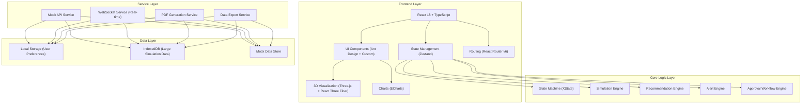
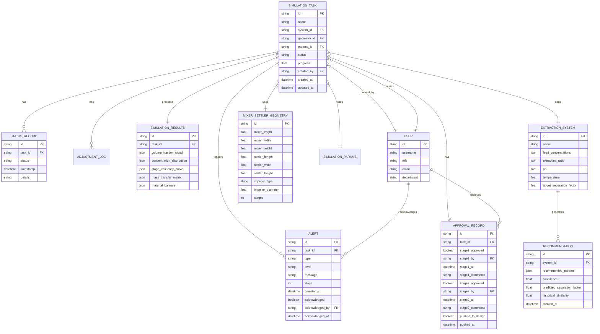

## 1. Architecture Design



## 2. Technology Description

- **Frontend Framework**: React@18.2.0 + TypeScript@5.3.0
- **Build Tool**: Vite@5.0.0
- **Styling**: TailwindCSS@3.4.0 + CSS Variables
- **UI Component Library**: Ant Design@5.12.0 + Custom Components
- **State Management**: Zustand@4.4.0
- **Routing**: React Router@6.20.0
- **State Machine**: XState@4.38.0
- **3D Visualization**: Three@0.160.0 + @react-three/fiber@8.15.0 + @react-three/drei@9.92.0
- **Charts**: ECharts@5.4.0
- **PDF Generation**: jspdf@2.5.0 + html2canvas@1.4.0
- **Date Handling**: dayjs@1.11.0
- **Icons**: @ant-design/icons@5.2.0 + lucide-react@0.294.0
- **Backend**: None (纯前端Mock实现)
- **Database**: IndexedDB + LocalStorage (本地持久化)
- **Mock Data**: 内置丰富的模拟数据，包含完整的稀土萃取体系案例

## 3. Route Definitions

| Route | Purpose |
|-------|---------|
| /dashboard | 工作台首页 - 任务概览、实时监控、预警通知 |
| /tasks | 任务列表页 - 所有模拟任务管理 |
| /tasks/new | 新建任务页 - 萃取体系、几何构造、模拟参数配置 |
| /tasks/:id | 任务详情页 - 状态流转、实时监控、可视化结果、审批流程 |
| /tasks/:id/report | 报告预览页 - PDF报告在线预览与下载 |
| /recommendation | 智能推荐页 - 最优参数推荐、历史对比分析 |
| /statistics | 统计看板页 - KPI指标、性能雷达图、趋势分析 |
| /settings | 系统设置页 - 预警阈值、用户权限、体系管理 |
| /settings/thresholds | 预警阈值配置 |
| /settings/users | 用户权限管理 |
| /settings/systems | 萃取体系管理 |

## 4. API Definitions (Mock)

### Type Definitions

```typescript
// 萃取体系组分
interface ExtractionSystem {
  id: string;
  name: string;
  feedConcentrations: {
    element: string;
    concentration: number;
    unit: string;
  }[];
  extractantRatio: {
    [key: string]: number;
  };
  ph: number;
  targetSeparationFactor: number;
  temperature: number;
}

// 混合澄清槽几何构造
interface MixerSettlerGeometry {
  mixerLength: number;
  mixerWidth: number;
  mixerHeight: number;
  settlerLength: number;
  settlerWidth: number;
  settlerHeight: number;
  impellerType: string;
  impellerDiameter: number;
  stages: number;
  baffleConfig: string;
}

// 模拟任务状态枚举
enum SimulationStatus {
  PENDING_VERIFICATION = 'pending_verification',
  MESHING = 'meshing',
  TWO_PHASE_FLOW = 'two_phase_flow',
  MASS_TRANSFER = 'mass_transfer',
  EFFICIENCY_EVALUATION = 'efficiency_evaluation',
  COMPLETED = 'completed',
  ABNORMAL_ROLLBACK = 'abnormal_rollback',
  PAUSED = 'paused'
}

// 模拟任务
interface SimulationTask {
  id: string;
  name: string;
  system: ExtractionSystem;
  geometry: MixerSettlerGeometry;
  simulationParams: SimulationParams;
  status: SimulationStatus;
  statusHistory: StatusRecord[];
  progress: number;
  monitoringData: MonitoringData;
  alerts: Alert[];
  adjustmentLog: AdjustmentLog[];
  results: SimulationResults;
  approval: ApprovalRecord;
  createdAt: string;
  createdBy: string;
  updatedAt: string;
}

// 监控数据
interface MonitoringData {
  interfacialTension: TimeSeriesData[];
  distributionRatio: {
    [element: string]: TimeSeriesData[];
  };
  residenceTimeDistribution: TimeSeriesData[];
  extractionRate: number[];
  separationFactor: number[];
}

// 预警
interface Alert {
  id: string;
  type: 'extraction_rate_low' | 'emulsification' | 'deviation_high' | 'convergence_failed';
  level: 'warning' | 'danger' | 'critical';
  message: string;
  stage: number;
  timestamp: string;
  acknowledged: boolean;
  acknowledgedBy: string;
  acknowledgedAt: string;
}

// 模拟结果
interface SimulationResults {
  volumeFractionCloud: CloudData;
  concentrationAxialDistribution: {
    [element: string]: number[];
  };
  stageEfficiencyCurve: number[];
  raffinateRatePrediction: number[];
  massTransferCoefficientMatrix: number[][];
  materialBalance: {
    inlet: number;
    outlet: number;
    error: number;
  };
}

// 审批记录
interface ApprovalRecord {
  stage1: {
    approved: boolean;
    approvedBy: string;
    approvedAt: string;
    comments: string;
  };
  stage2: {
    approved: boolean;
    approvedBy: string;
    approvedAt: string;
    comments: string;
  };
  pushedToDesign: boolean;
  pushedAt: string;
}

// 统计数据
interface StatisticsData {
  completionRate: number;
  averageStageEfficiency: number;
  optimizationConvergenceCount: number;
  totalTasks: number;
  completedTasks: number;
  failedTasks: number;
  monthlyTrend: {
    month: string;
    completed: number;
    efficiency: number;
  }[];
  radarData: {
    dimension: string;
    value: number;
    threshold: number;
  }[];
}

// 智能推荐
interface Recommendation {
  id: string;
  systemId: string;
  recommendedExtractantRatio: {
    [key: string]: number;
  };
  recommendedImpellerType: string;
  recommendedStirringSpeed: number;
  recommendedPhaseRatio: number;
  confidence: number;
  predictedSeparationFactor: number;
  historicalSimilarity: number;
}
```

### Mock API Endpoints

| Method | Endpoint | Description |
|--------|----------|-------------|
| GET | /api/tasks | 获取任务列表 |
| GET | /api/tasks/:id | 获取任务详情 |
| POST | /api/tasks | 创建新任务 |
| PUT | /api/tasks/:id | 更新任务 |
| DELETE | /api/tasks/:id | 删除任务 |
| GET | /api/tasks/:id/monitoring | 获取实时监控数据 |
| POST | /api/tasks/:id/acknowledge-alert | 确认预警 |
| POST | /api/tasks/:id/adjust-params | 调整模拟参数 |
| POST | /api/tasks/:id/approve/stage1 | 一级审批 |
| POST | /api/tasks/:id/approve/stage2 | 二级审批 |
| GET | /api/tasks/:id/report | 生成/获取PDF报告 |
| GET | /api/recommendation | 获取智能推荐 |
| GET | /api/statistics | 获取统计数据 |
| GET | /api/statistics/daily | 获取每日统计 |
| GET | /api/settings/thresholds | 获取预警阈值 |
| PUT | /api/settings/thresholds | 更新预警阈值 |
| GET | /api/systems | 获取萃取体系列表 |
| POST | /api/systems | 新增萃取体系 |
| GET | /api/users | 获取用户列表 |
| PUT | /api/users/:id/permissions | 更新用户权限 |

## 5. Data Model

### 6.1 Data Model Definition



### 6.2 Data Definition Language (IndexedDB)

```javascript
// IndexedDB Schema Definition
const dbSchema = {
  name: 'RareEarthExtractionDB',
  version: 1,
  stores: [
    {
      name: 'simulation_tasks',
      keyPath: 'id',
      indexes: [
        { name: 'status', keyPath: 'status', unique: false },
        { name: 'createdAt', keyPath: 'createdAt', unique: false },
        { name: 'createdBy', keyPath: 'createdBy', unique: false },
        { name: 'systemId', keyPath: 'system.id', unique: false }
      ]
    },
    {
      name: 'extraction_systems',
      keyPath: 'id',
      indexes: [
        { name: 'name', keyPath: 'name', unique: true },
        { name: 'ph', keyPath: 'ph', unique: false }
      ]
    },
    {
      name: 'geometries',
      keyPath: 'id',
      indexes: [
        { name: 'impellerType', keyPath: 'impellerType', unique: false },
        { name: 'stages', keyPath: 'stages', unique: false }
      ]
    },
    {
      name: 'alerts',
      keyPath: 'id',
      indexes: [
        { name: 'taskId', keyPath: 'taskId', unique: false },
        { name: 'level', keyPath: 'level', unique: false },
        { name: 'acknowledged', keyPath: 'acknowledged', unique: false }
      ]
    },
    {
      name: 'recommendations',
      keyPath: 'id',
      indexes: [
        { name: 'systemId', keyPath: 'systemId', unique: false },
        { name: 'confidence', keyPath: 'confidence', unique: false }
      ]
    },
    {
      name: 'users',
      keyPath: 'id',
      indexes: [
        { name: 'role', keyPath: 'role', unique: false },
        { name: 'username', keyPath: 'username', unique: true }
      ]
    },
    {
      name: 'statistics',
      keyPath: 'date',
      indexes: [
        { name: 'month', keyPath: 'month', unique: false }
      ]
    },
    {
      name: 'settings',
      keyPath: 'key',
      indexes: []
    }
  ]
};

// Initial Mock Data
const initialData = {
  users: [
    { id: 'u001', username: '张工', role: 'engineer', email: 'zhang@metallurgy.com', department: '湿法冶金部' },
    { id: 'u002', username: '李工', role: 'process_engineer', email: 'li@metallurgy.com', department: '工艺部' },
    { id: 'u003', username: '王总', role: 'chief_engineer', email: 'wang@metallurgy.com', department: '总工办' },
    { id: 'u004', username: '陈首席', role: 'chief_scientist', email: 'chen@metallurgy.com', department: '研究院' },
    { id: 'u005', username: '设计组', role: 'design_team', email: 'design@metallurgy.com', department: '设备设计部' },
    { id: 'u006', username: '管理员', role: 'admin', email: 'admin@metallurgy.com', department: '信息中心' }
  ],
  
  systems: [
    {
      id: 'sys001',
      name: 'La/Ce分离体系-1',
      feedConcentrations: [
        { element: 'La', concentration: 0.15, unit: 'mol/L' },
        { element: 'Ce', concentration: 0.12, unit: 'mol/L' },
        { element: 'Pr', concentration: 0.08, unit: 'mol/L' },
        { element: 'Nd', concentration: 0.10, unit: 'mol/L' }
      ],
      extractantRatio: { P507: 1.0, kerosene: 3.0, TBP: 0.5 },
      ph: 3.5,
      temperature: 25,
      targetSeparationFactor: 2.5
    }
  ],
  
  settings: [
    { key: 'alert_thresholds', value: {
      minExtractionRate: 0.85,
      maxEmulsificationIndex: 0.3,
      maxDeviationPercentage: 15,
      convergenceIterations: 100
    }},
    { key: 'current_user', value: 'u001' }
  ]
};
```

